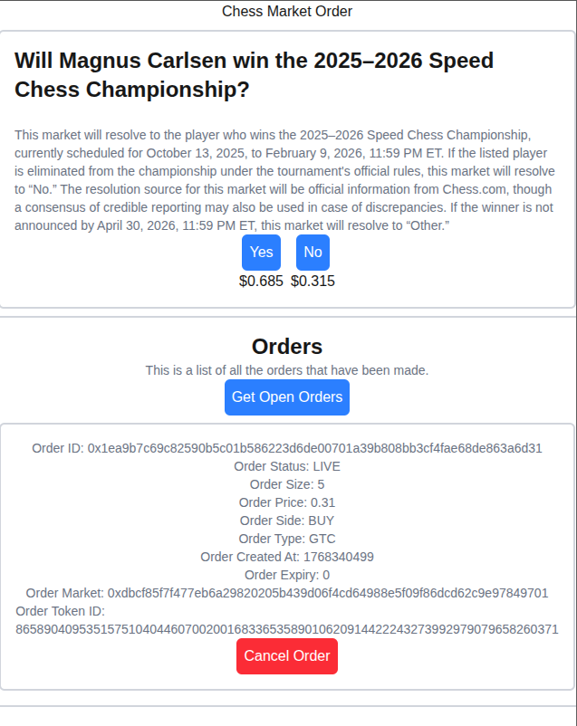

# Polymarket CLOB Demo

A minimal, end-to-end example of authenticating a wallet and interacting with Polymarket's CLOB to create, list, and cancel orders.



## Features

- **Wallet Authentication**: Authenticate using a private key
- **Create Orders**: Create buy/sell orders on Polymarket markets
- **List Orders**: View your open orders
- **Cancel Orders**: Cancel existing orders

## Prerequisites

- Node.js 18+ 
- npm, yarn, pnpm, or bun
- A wallet with a private key

## Setup

1. Install dependencies:

```bash
npm install
```

2. Create a `.env.local` file in the root directory and add your private key:

```env
NEXT_PUBLIC_PRIVATE_KEY=your_private_key_here
```

> ⚠️ **Security Warning**: This demo uses a test private key. **Never** save production private keys to environment variables, and **never** load a production private key in client-side code. Private keys exposed in client-side code can be accessed by anyone and will result in loss of funds.

## Running the Application

Start the development server:

```bash
npm run dev
```

Open [http://localhost:3000](http://localhost:3000) in your browser.

## Usage

1. The app will automatically fetch market data for the configured market
2. Connect your wallet using the private key from your environment variables
3. Create orders by selecting a token and price
4. View your open orders
5. Cancel orders as needed

## Tech Stack

- **Next.js 16** - React framework
- **@polymarket/clob-client** - Polymarket CLOB client library
- **ethers** - Ethereum library for wallet operations
- **TypeScript** - Type safety
- **Tailwind CSS** - Styling

## Configuration

The app is configured to use:
- **Host**: `https://clob.polymarket.com`
- **Chain ID**: 137 (Polygon mainnet)
- **Market**: Magnus Carlsen Speed Chess Championship (configurable in `app/api/markets/route.ts`)

## Security

**Important**: This demo is for educational purposes only and uses a test private key. 

- ⚠️ **Never** save production private keys to environment variables
- ⚠️ **Never** load production private keys in client-side code (anything with `NEXT_PUBLIC_` prefix is exposed to the browser)
- ⚠️ Private keys exposed in client-side code can be accessed by anyone viewing the page source or browser console
- ⚠️ This will result in **permanent loss of funds**

For production applications, use proper wallet authentication methods such as MetaMask, WalletConnect, or server-side signing.
